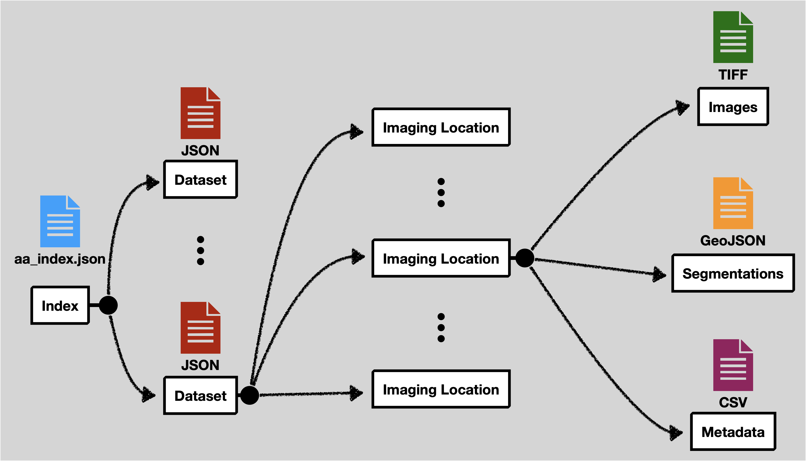

# Aardvark Data Structure

This repository contains documentation on the data format expected by the Aardvark visualization system. In addition, it contains various scripts to help convert data into this format.

At a high level the data expects feature tables as CSV, images as TIFF files, and cell segmentation boundaries as GeoJSON files. All of these files are explicitly linked together with JSON files.

To access the data from Aardvark the data must be available on a URL, e.g. https://example.com. At the root of that URL, a special file is expected with the given name `aa_index.json`. So if the data is hosted at https://example.com, then https://example.com/aa_index.json should open this file.
